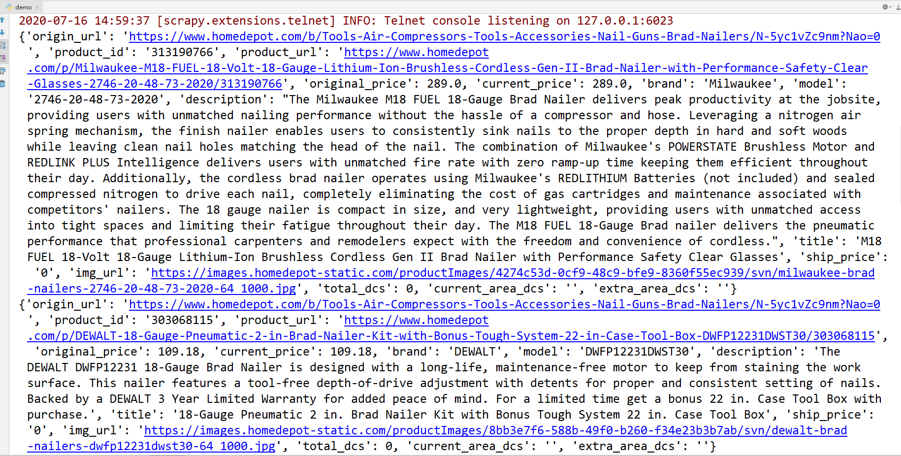

# homedepot爬虫文档总结

## 一、反爬
* 国外网站，需要翻墙访问
* 需要的所有数据都在json字符串中，需要找到获取json的接口
    
## 二、爬取思路
* 先从主页 [homedepot](https://www.homedepot.com/c/site_map) 爬取所有分类的url，具体到有产品的那一级地址
    
## 三、网站特点
* 网站最多显示30页，每页24条数据
* 超过30页的地址，需要再进行筛选，直到数据量不超过720条
* 把这些初始url放到一个列表中，或者放入redis中，可以进行分布式爬取
***

## 难点
* 爬取初始的url，需要进行筛选，稍微有点麻烦，需要自己找规律
***

## 运行结果截图
    
