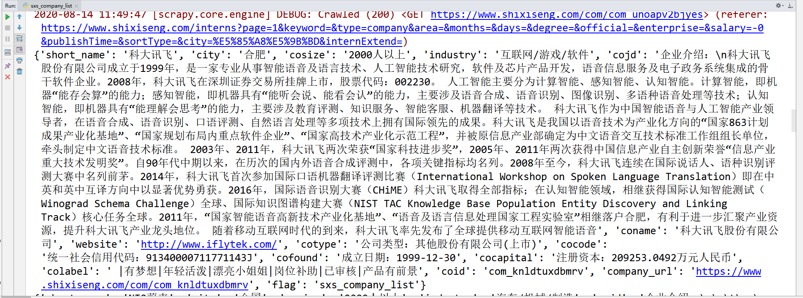

# 实习僧公司页爬虫总结

## 一、反爬
* 无
***

## 二、爬取思路
* 根据实习僧 [公司名录](https://www.shixiseng.com/interns?page=1&keyword=&type=company&area=&months=&days=&degree=&official=&enterprise=&salary=-0&publishTime=&sortType=&city=%E5%85%A8%E5%9B%BD&internExtend=) 抓取公司信息
* 每个公司详情页里边，会包括该公司所有的招聘信息
* 抓取的时候把这些职位信息的jobid抓取下来，存储至redis中
* 进一步抓取职位详情信息
***

## 公司页运行结果截图

