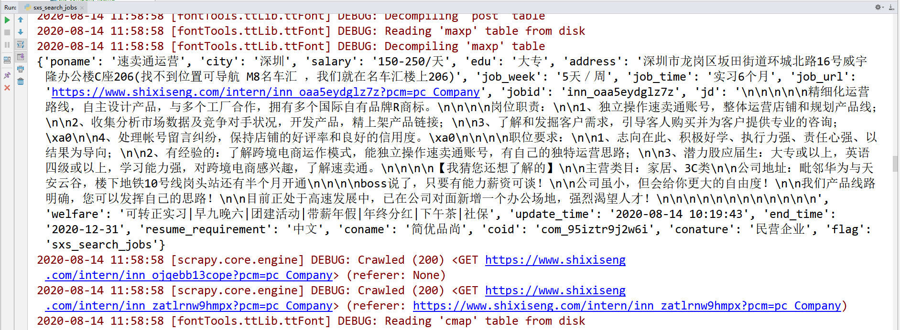

# 实习僧职位详情爬虫总结

## 一、反爬
* 字体反爬
    * 解决办法：结合博客 [python抓取实习僧](https://www.cnblogs.com/szj22233060/p/10056208.html) 实现对该网站的字体破解步骤
* 代码运行过程中会出现302状态码，做好判断即可
***

## 二、爬取思路
* 每月先爬取公司名录，在爬取的时候jobid会同步存放至redis中
* 部署分布式
* 做好各种异常判断
***

## 职位详情页运行结果截图

