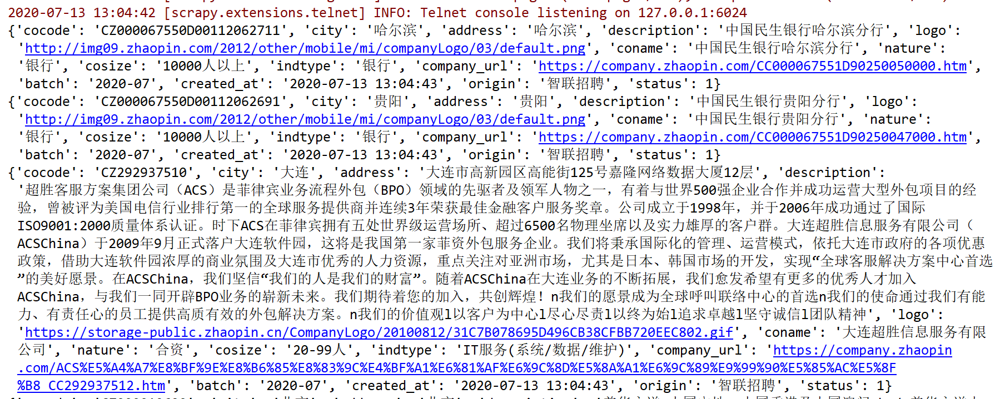

# 智联招聘公司详情页爬虫总结

## 一、反爬
* cookie加密，需要逆向破解

* 公司详情页不封IP
    
## 二、爬取思路
* 每个月月初爬取一遍智联招聘列表页，列表页爬取结束之后根据sql语句：

* `SELECT DISTINCT company_url FROM zhaopin_search_jobs WHERE batch='当月爬取批次' and company_url like '%company.zhaopin.com%' LIMIT 10;`

* 就能得到唯一的company_url，然后把查询出来的url导出结果（大约有25万左右），放到redis中，最后进行分布式爬取
    
## 三、网站特点
* 根据爬取下来的公司详情url中，根据域名把url分为两大类
    * 域名为`special.zhaopin.com`，大约有一万条左右如：`http://special.zhaopin.com/pagepublish/65936012/index.html`
        
        这种url，解析规则有数十种，暂时不考虑解析
    
    * 域名为`company.zhaopin.com`
    
        * 数据都在源码中的json字符串中，正则截取出来json.loads()，就可以得到能够json解析的数据了。
        
        * 分为两种情况：
        
        1. url没有数据，如：https://company.zhaopin.com/CC142406870.htm
        2. 有数据，可以正常解析
    > 不规则的公司详情页，不考虑解析，几百条数据
***

## 查看运行结果
    

