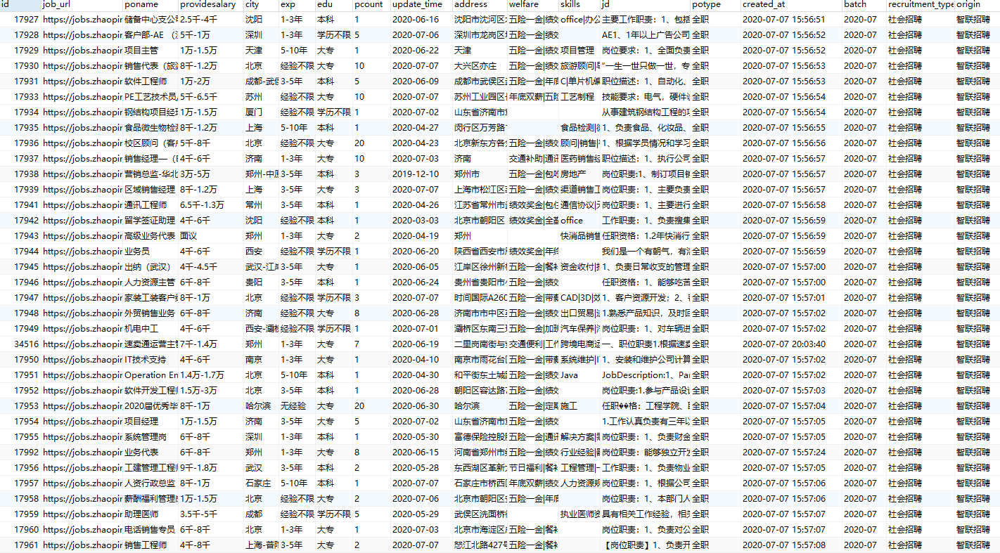

# 智联招聘职位详情页爬虫总结

## 一、反爬
* cookie加密，需要逆向破解
* 封IP，需要携带代理IP
***
    
## 二、爬取思路
* 每个月月初爬取一遍智联招聘列表页，列表页爬取结束之后根据sql语句：
 `SELECT DISTINCT job_url FROM zhaopin_search_jobs WHERE batch='当月爬取批次';`
 就能得到唯一的job_url，然后把查询出来的url导出结果，放到redis中，最后进行分布式爬取
 ***
    
## 三、网站特点
* 从列表页中取出job_url
    * 注：列表页爬取的job_url中的协议为http，需要利用`replace`函数将其替换为https协议，否则请求不到数据。如：`http://jobs.zhaopin.com/262421128250084.htm`替换为`https://jobs.zhaopin.com/262421128250084.htm`

* 详情页分为两个部分
    * 校园招聘
    * 社会招聘
***

## 查看运行结果

