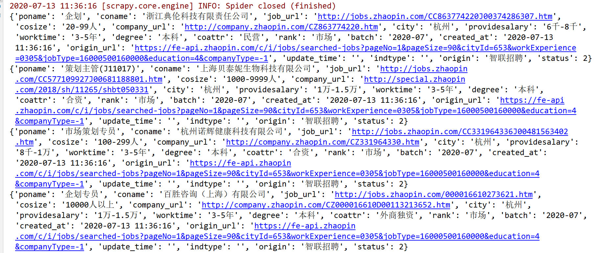

# 智联招聘列表页爬虫总结

## 202007版本

### 智联招聘网站升级

### 反爬

* 数据通过ajax加载
* 没有封IP的限制
* 网页最多显示3页数据，从第四页开始需要登录才能获取数据
    * 解决办法：通过对ajax接口里边的参数进行条件筛选，深度爬取
***

### 网页特点

* 每页最多显示90条数据，经测试数据通过接口 *https://fe-api.zhaopin.com/c/i/jobs/searched-jobs?pageNo=1&pageSize=90&cityId=-1&workExperience=-1&jobType=-1&education=-1&companyType=-1&companySize=-1* 返回数据
* 接口参数含义
    * pageSize: 返回数据的数量，默认返回50条，最多返回90条
    * pageNo: 翻页参数，默认为1
    * cityId: 城市id，默认为-1，如：`北京` 的id为 `530`
    * workExperience: 工作经验参数，默认为-1，如：`1-3年` 经验为 `0103`
    * jobType: 职位类型id，默认为-1，如：`汽车销售` 为 `19000200150000`
    * education: 学历要求，默认为-1，如：`本科` 为 `4`
    * companyType: 公司性质，默认为-1，如：`国企` 为 `1`
    * companySize: 公司规模，默认为-1，如：`100-299人` 为 `3`
***

### 爬取思路

* 对jobtype、city、edu、exp进行初始url拼接
* 当url返回数据大于270条时，再对cotype进行筛选爬取
* 筛选之后，url返回数据大于270时，再对cosize进行筛选爬取
***

### BUG

* 代码在本地运行正常，一旦部署到服务器上，会出现封IP的现象
* 原因：应该是阿里云服务器的IP段被智联给封了
* 建议在本地跑，不封IP
***

## 查看运行历史
