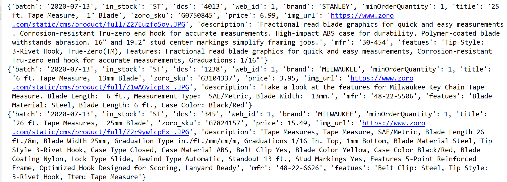

# zoro网站爬虫总结

## 反爬
* 该网站为外国网站，需要开翻墙
* 没有封IP的限制
* 解析库存的时候，请求为post请求
***

## 网站特点
* 每页显示36条数据，没有最多显示页码限制
* 不封IP
* 爬取的时候容易出现301状态码，做好判断即可
***

## 爬取思路
* 从[zoro主页](https://www.zoro.com/)先爬取所有的初始url，放入txt文件中，或者放到一个列表中
* 从列表或者txt文件中取出url，进行爬取
    * 判断是否有下一页
    * 判断产品是否有库存，库存为0的放弃
***
    
## 查看运行历史

 